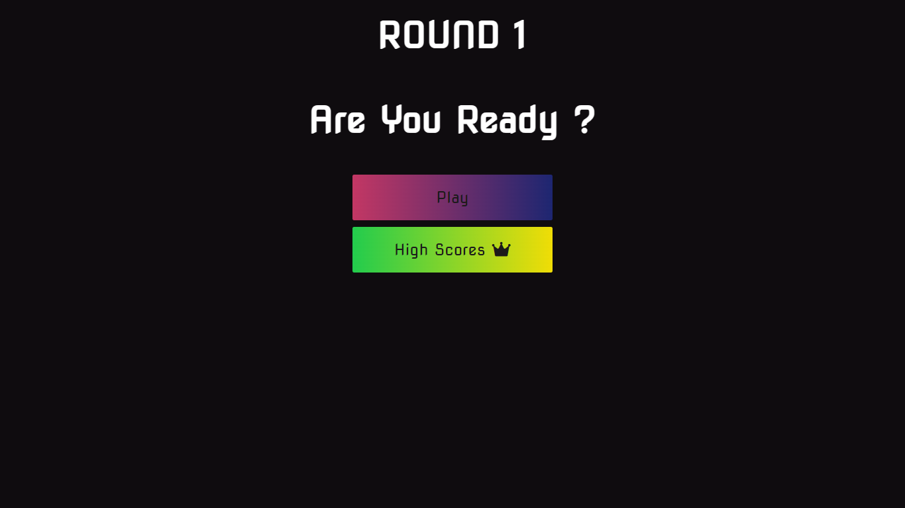
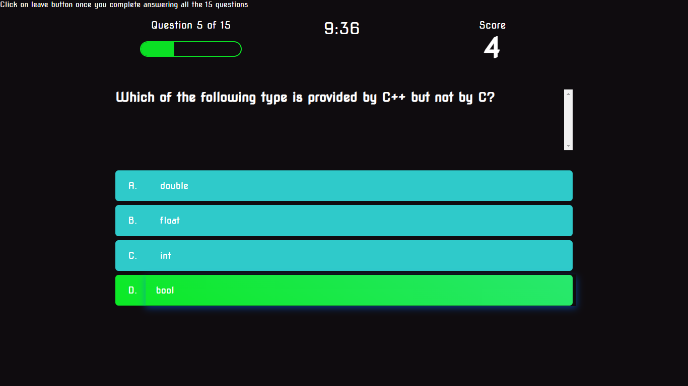
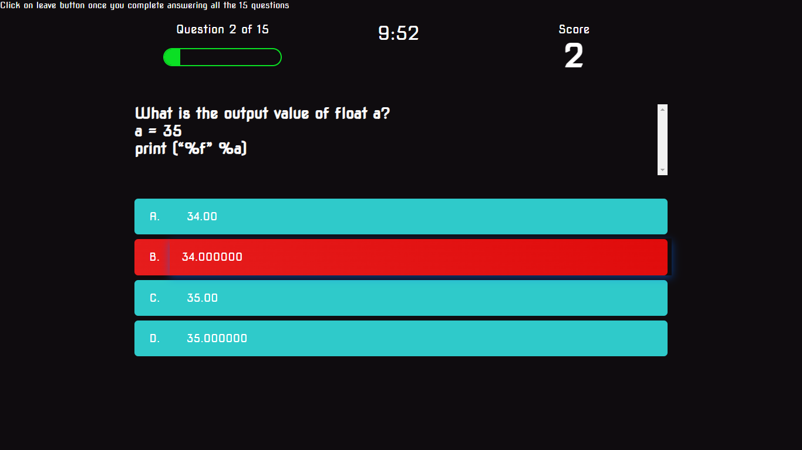
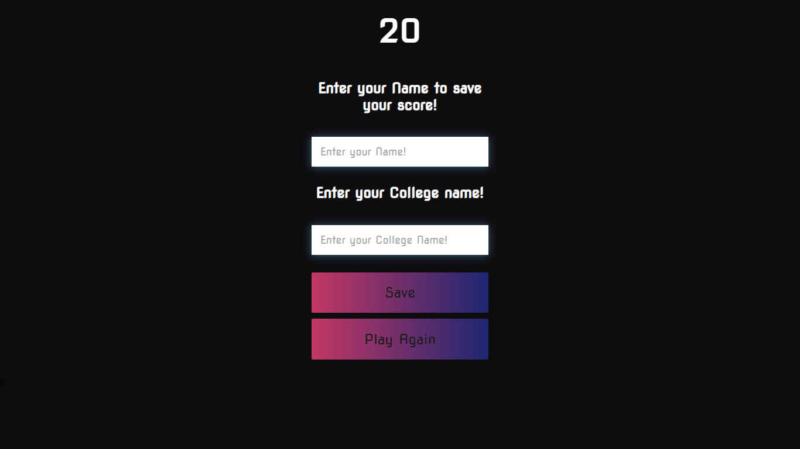

# Quiz Application

A dynamic quiz application developed using HTML, CSS, and JavaScript. The application features a progress bar, score tracker, and local storage for saving scores with player names. It leverages MySQL server for efficient data storage and retrieval, ensuring seamless performance and an enhanced user experience.

## Features

- Interactive and engaging quiz interface
- Progress bar to track quiz completion
- Score tracker to display and save user scores
- Local storage for storing scores with player names
- Responsive design for optimal viewing on various devices

## Technologies Used

- HTML, CSS, and JavaScript for front-end development
- PHP and MySQL server for efficient data storage and retrieval

## Usage

1. Clone the repository.
2. Set up the MySQL server and configure the necessary database and tables.
3. Open the `index.html` file in a web browser to access the quiz application.
4. Select a quiz category and start answering the questions.
5. The progress bar will indicate the quiz completion, and the score will be updated in real-time.
6. At the end of the quiz, enter your name to save your score with player details in local storage.

## Screenshots

  

  

  

  

## Contributions

Contributions are welcome! Open issues and submit pull requests for improvements or bug reports.

